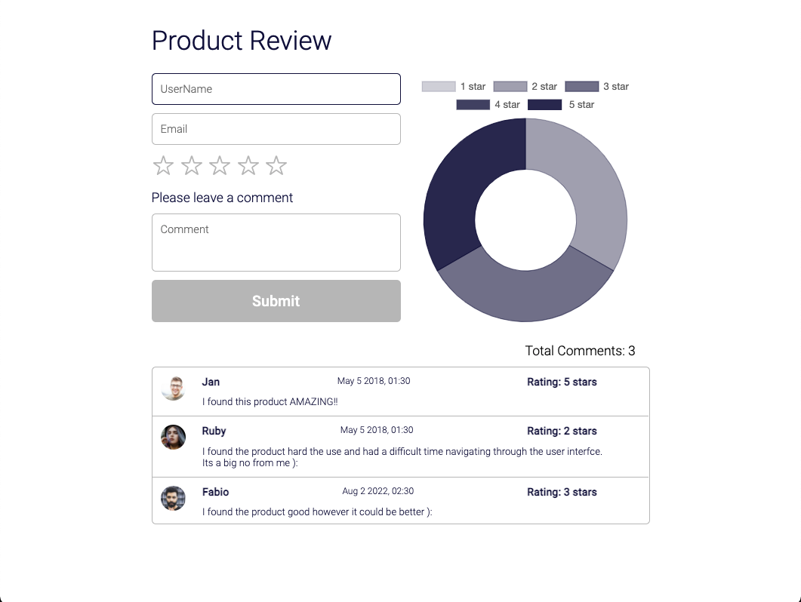

# Product review

Allows users to add a comment with a rating which displays data on a doughnut chart. (struggles & improvements in notes.md file)

## Run the app in Visual Studio
1. Install dependancies
```
npm install 
```
2. Run app
```
npm start
```



## How to use the product review
1. Enter in a username (the name must be less than 10 characters)
```
Rafael
```
2. Enter in an email (the email must have a "@" and ".")
```
test@email.com
```
3. Choose rating by clicking a star (rating must at least be one star )
4. Enter in a comment (comment must contain one character)
```
I loved this product!
```
5. Press the submit button 
6. If all fields are valid it should show a comment like the pic below...


